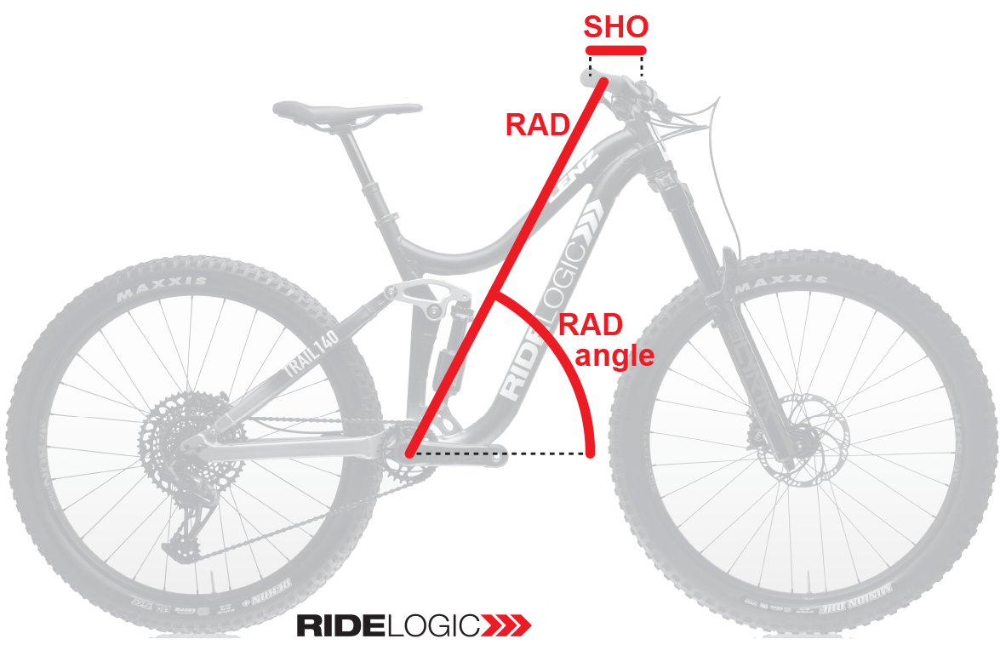
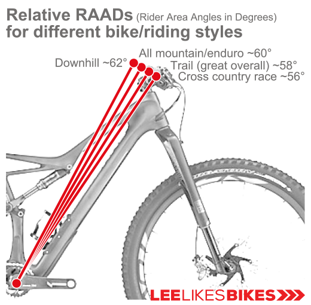
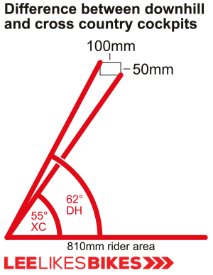
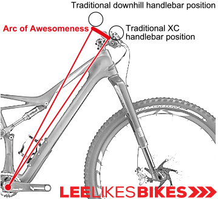
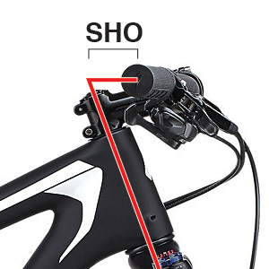

# OpenRAD Calculator

## This is the Open-source version on Lee McCormack's Mountain Bike fit calculator 
This calculator uses **RAD** and **RAAD** to fit your body’s size, proportions, and your riding style. 
When your RAD is dialed, two great things happen:
1. You have optimal arm range for bike handling: descending, braking, cornering, pumping, dropping and all the fun stuff 
2. You can generate maximum torque for power moves: sprinting, steep climbing, pumping, manualing, hopping and wheelie drops. 

### RAD (Rider Area Distance) 

When it comes to mountain bike setup, the most important measurement is the distance between your bottom bracket and your grips. 
Lee McCormack calls this the **Rider Area Distance (RAD)**.

RAD is the hypotenuse of a triangle whose other two sides are the reach and stack of your entire cockpit, from the bottom bracket to your grips.

#### The components of RAD are: 
• Frame reach 
• Frame stack 
• Height of spacers under your stem 
• Tallness of your stem’s steerer clamp 
• Handlebar rise 
• Handlebar setback (SHO). 

### RAAD (Rider Area Angle) 
Put simply, the steeper the line from your bottom bracket to your grips, the more range of motion you’ll have for braking, cornering and going down things, and the better your bike will feel on technical descents. The shallower that line, the more your bike will feel optimized for climbs.

#### Recommended RAAD for Trail Full-Suspension = 58° 
#### Recommended RAAD for Trail Hardtail = 58-60° (56-58° Sagged) 

#### Less angle pros: 
• As the bars get farther away from the rider (within reason), the rider gains more potential sprint and climbing power.
The rider can pull the bars farther before they hit the hips. Some pro BMXers say moving the bars away gives them more “pull.” This is what they’re feeling. 
• Traditional road and cross country riders will find the longer cockpit familiar.
(But the bars will feel low unless you raise the bars, which will give you a traditional XC fit with an excessive bike RAD — and that’s not what we’re doing here). 
#### Less angle cons: 
• The rider gives up range of motion on steep downhills, jump landings and in corners.
If staying off your face is important to you, do not reduce your rider area angle. 
• The traditionally long cockpit usually comes with bars that are too high, which makes a too-long rider area and decreases power out of the saddle.
The ”wisdom” that long stems improve climbing is bullshit, especially when standing. 

  
  

### SHO (Steering/Hand offset)

SHO is the horizontal line that runs from the steering axis to the midpoint of the grips. 

Your favorite SHO (if you have one) is determined by your riding style, personal preference or (most likely) what you’re accustomed to riding. 
If you have a favorite handlebar/stem combo, you might like the SHO they create. 

What does SHO mean?
We humans can ride a wide range of setups, from 150mm XC stems to direct-mount downhill downhill stems. We are very adaptable.
That said, your bike’s SHO has definite effects on your riding. Here are some general notions:

#### 1. Positive SHO
When your hands are in front of your steering axis, you have positive SHO. An XC race bike might have 50mm or more of SHO. A typical trail bike might have 20mm or more of SHO. 
When you have positive SHO: 
• When you steer from one side to the other, your bars arc away from you, then they arc toward you. This is very pronounced on a road bike. 
• When you lean or push forward on the bar, the bike wants to go straight. This saves riders who tend to lean forward on downhills. Leaning forward is a bad habit. 
• Your bike handles great at low speed in technical terrain. It might feel a bit sketchy at high speed on rough terrain. 

#### 2. Negative SHO
When your hands are behind the steering axis, you have negative SHO. Some downhill bikes have SHOs of -20mm or less. Motocross motorcycles have even less SHO. 
When you have negative SHO: 
• When you steer from one side to the other, your bars arc toward you, then they arc away from you. 
• When you lean or pull backward on the bar, your bike wants to go straight. This this might feel good when going fast in a straight line, but leaning backward is a bad habit. 
• Your bike feels very stable at high speed. It might feel ponderous at low speed. 

#### 3. Neutral SHO
When your hands are in line with the steering axis, you have neutral SHO. Well-dialed trail, enduro and downhill bikes might have +10 to -10 SHO. The best are very close to zero. 
When you have neutral SHO: 
• When you steer from one side to the other, your bars follow a simple arc, like a steering wheel. 
• Your bike handles the same whether you’re pulling or pushing the bars. Your hands should have neutral weight (light hands, heavy feet!). 
• Your bike handles well at all speeds and all terrain. The closer you get to zero SHO — ideally within ±5mm — the better your bike feels. 

#### The best-handling bikes often have neutral SHOs! 

### Learn more about RAD 
Original idea by Lee from LeeLikesBikes 
You can learn more about RAD on his website: https://www.leelikesbikes.com/rad-bike-setup.html
